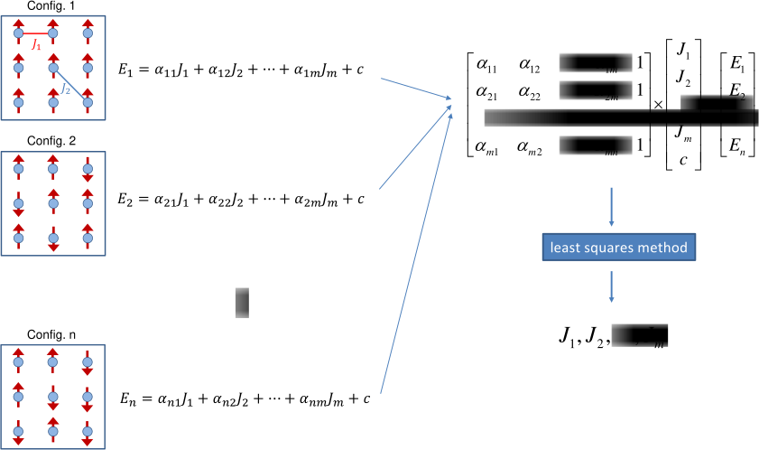

Introduction to SUPERHEX
=========================

SUPERHEX is a Python code that generates all possible supercell structures within a specified size range, then ranks them based on the farthest Heisenberg exchange interactions that can be computed for each structure.

Using a supercell with various magnetic configurations allows us to map *ab initio* results, such as those from DFT, to the Heisenberg Hamiltonian. The following figure from *Phys. Rev. B* 108, 144413 (`https://journals.aps.org/prb/abstract/10.1103/PhysRevB.108.144413 <https://journals.aps.org/prb/abstract/10.1103/PhysRevB.108.144413>`_) illustrates this mapping:

However, due to periodic boundary conditions, these results are limited to specific nearest neighbors. To push this limit and consider more interactions, larger supercells are needed, though this comes with increased computational costs.

Typically, researchers generate supercells by multiplying lattice vectors by integers. However, this method can lead to very time-consuming *ab initio* calculations. In contrast, SUPERHEX generates all possible supercell structures, analyzes the coefficient matrix obtained from the Heisenberg Hamiltonian, and then identifies the optimal supercell structure. This approach helps find the smallest supercell required for a given number of exchange interactions, potentially speeding up DFT calculations by 1 to 2 orders of magnitude.

For more information on this technique, please refer to:

`https://arxiv.org/abs/2410.14356 <https://arxiv.org/abs/2410.14356>`_

Please cite the above reference if you use this method.

