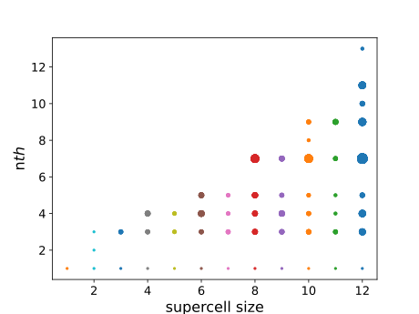

.. _tutorial:

Tutorial: Running superhex
===========================

In this tutorial, you will learn how to run `superhex` using example files from the `tests` directory.

Step 1: Create a Working Directory
------------------------------------

First, create a directory (named `example` here) outside the code directory, and navigate into it:

.. code-block:: bash

    $ mkdir example
    $ cd example

Step 2: Copy the Example Files
-------------------------------

Copy the required example files from the `tests` directory in the `superhex` code:

.. code-block:: bash

    $ cp superhex_dir/tests/bulk_examples/MnTe/input.txt .
    $ cp superhex_dir/tests/bulk_examples/MnTe/MnTe.vasp .

Step 3: Understand the Required Input Files
---------------------------------------------

To run `superhex`, you only need:

- An input file (in JSON format), named `input.txt`.
- A structure file (in VASP, CIF, or other formats).

You can find both of these files in the `MnTe` directory.

To view the contents of the `input.txt` file, run:

.. code-block:: bash

    $ cat input.txt

Here’s an example of what the `input.txt` file might look like:

.. code-block:: json

   {
       "structure_file": "MnTe.vasp",
       "LatDim": 3, 
       "range_volume": true, 
       "volumes": [1, 12],
       "magnetic_atoms": ["Mn"],
       "cutoff_radius": 25,
       "n_configs": 100,
       "all_configs": false, 
       "verbosity": "high",
       "seed": 42, 
       "num_processes": 4
   }

For more details on the input file format, refer to the :ref:`input_format`.


Step 4: Run the superhex Program
----------------------------------

Run the `superhex` program in the `example` directory:

.. code-block:: bash

    $ superhex

After the run, the following output files will be generated:

- `log.txt`
- `struct_analysis.csv`
- A `supercells` directory containing the generated supercells.


The program indexes each supercell structure by cell volume (denoted as ``m``). For each supercell volume, multiple distinct structures can be generated. These structures are indexed by ``n``, starting from 0 and incrementing to the total number of unique structures for that specific supercell volume. 

Within the ``supercells`` directory, the files are named as: cell-vol ``m`` -num ``n``.vasp, where:
- ``m`` represents the supercell volume, and
- ``n`` is the structure index.

The ``log.txt`` file contains information about the matrix transformations applied to each supercell structure. The details are labeled in the following format:

```
-----volume: m Structure number: n-----
```

Here, ``m`` indicates the supercell volume, and ``n`` refers to the structure index.


The file ``struct_analysis.csv`` contains all the necessary information for selecting an appropriate supercell for exchange calculations.
For this example, the first 30 lines of ``struct_analysis.csv`` are shown below:

.. csv-table:: Supercell Structures Data
   :header: "struct_vol", "struct_num", "first_dep_col_ind", "permitted_farthest_J", "rank", "independent_configs", "latt_abc_var"
   :widths: 10, 10, 20, 25, 10, 20, 20

   12,27,14,J13,14,100.0,5.48660820765528
   12,30,14,J13,14,100.0,8.561867272534236
   12,29,12,J11,13,100.0,1.1947062536820172
   12,13,12,J11,13,100.0,1.5658469808176523
   12,52,12,J11,14,100.0,1.6380627038863593
   12,10,12,J11,13,100.0,5.092097760571457
   12,9,12,J11,13,100.0,5.092097762909088
   12,14,12,J11,13,100.0,5.486608232560253
   12,39,12,J11,12,100.0,6.523325306631343
   12,38,12,J11,12,100.0,6.982827312743242
   12,15,12,J11,13,100.0,8.938539139193637
   12,51,12,J11,14,100.0,12.412728808133906
   12,12,12,J11,13,99.0,8.56186722167447
   12,63,11,J10,11,100.0,0.021529503320156757
   12,62,11,J10,12,100.0,4.348528867033482
   12,64,11,J10,11,100.0,4.629240448747081
   12,58,11,J10,12,100.0,7.473741449396445
   12,65,11,J10,11,98.0,0.7051904465636488
   10,8,10,J9,11,100.0,4.215876318344207
   10,7,10,J9,11,100.0,6.834263957520261
   10,22,10,J9,12,99.0,7.810875500802208
   10,21,10,J9,12,98.0,0.15689188263818932
   11,13,10,J9,12,100.0,0.23654027233190766
   11,12,10,J9,12,100.0,1.6380626780132612
   11,8,10,J9,12,100.0,4.215876344289669
   11,7,10,J9,12,100.0,8.918310525742298
   11,11,10,J9,12,100.0,8.938539097782323
   11,14,10,J9,12,100.0,10.79158684628348
   12,41,10,J9,10,100.0,4.629240441738239

- The first column represents the supercell size (or volume), denoted as ``m``.
- The second column indicates the structure number within this volume, denoted as ``n``.
- The third column shows the index of the first dependent column of matrix :math:`\mathbb{A}`, introduced in the :doc:`introduction <intro>`.
- The fourth column specifies the farthest permitted Heisenberg exchange interaction that can be calculated for the structure with volume ``m`` and structure index ``n``.
- The fifth column represents the rank of matrix :math:`\mathbb{A}`.
- The sixth column shows the percentage of independent magnetic configurations generated from random configurations.
- The final column indicates the variation in lattice vectors.


You can use the ``plot_analysis.py`` script in the ``src/tools`` directory to visualize the data from ``struct_analysis.csv``:

.. code-block:: bash

   python plot_analysis.py



The resulting plot shows the allowed exchange interactions for supercell structures with sizes ranging from 1 to 12. The x-axis represents the supercell sizes, while the y-axis indicates the number of permitted exchange interactions for each structure.
Each supercell size includes several distinct structures. For example, at supercell size 8, there are 34 unique supercell structures. The size of the circles in the plot reflects the number of structures that allow the calculation of a specific number of exchange interactions.


According to the plot, if we want to calculate exchange interactions up to the 7th nearest neighbor (i.e., \( J_1, J_2, \dots, J_7 \)), we can use a supercell of size 8. There are several distinct structures of size 8 that allow the calculation of exchanges up to \( J_7 \).

To find the options, we can use the `grep` command in bash:

.. code-block:: bash

   grep J7 struct_analysis.csv

The first few lines of the result are as follows:

.. code-block:: bash
   8,2,8,J7,9,98.0,22.485831549654435
   8,13,8,J7,9,97.0,5.090066901962643
   8,8,8,J7,9,96.0,8.996710197481613
   8,19,8,J7,9,96.0,21.242606279366886
   8,7,8,J7,9,95.0,5.090066954230983


This shows that we can choose, for example, `cell-vol8-num2.vasp` from the `supercells` directory for calculating exchange interactions up to \( J_7 \).
